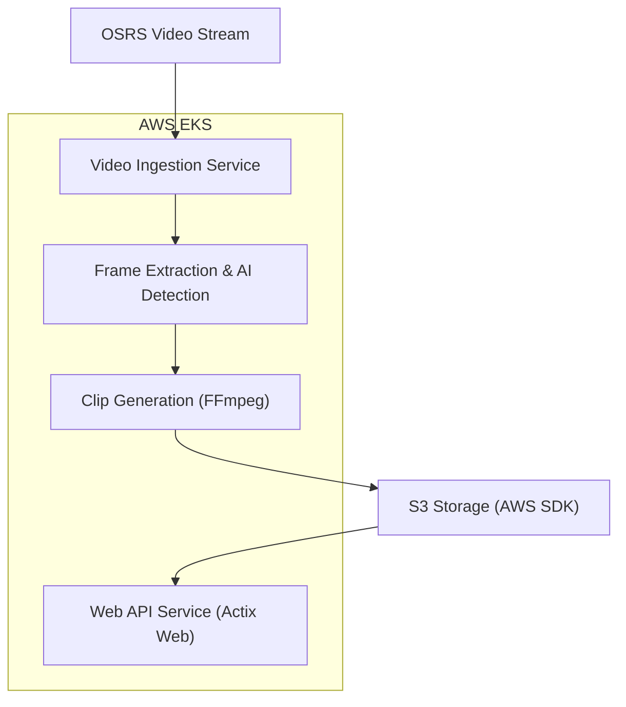

# OSRS Clipper


Our goal is to build an OSRS RuneScape clipping tool that does the following:

 - [ ] Detect Key Moments: Analyze an OSRS video stream to identify events like loot drops, PvP kills, or level-ups using computer vision or AI.

 - [ ] Generate Highlight Clips: When a key event is detected, automatically generate a video clip from the stream using tools like FFmpeg.

 - [ ] Store Clips on S3: Upload the generated clip to an Amazon S3 bucket for persistent storage.

 - [ ] Provide a Web API: Create an API using Actix Web to retrieve a list of clips and provide access to each clip’s URL.

 - [ ] Distributed Processing on EKS: Package the application as Docker containers and run them on AWS EKS for scalability.



### Setup
Start MinIO:
```
minio server ./data --console-address ":9001"
```

Create a `.env` with the following:
```
AWS_ACCESS_KEY_ID=minioadmin
AWS_SECRET_ACCESS_KEY=minioadmin
AWS_REGION=us-east-1
S3_ENDPOINT=http://127.0.0.1:9000
S3_BUCKET=clips
```
